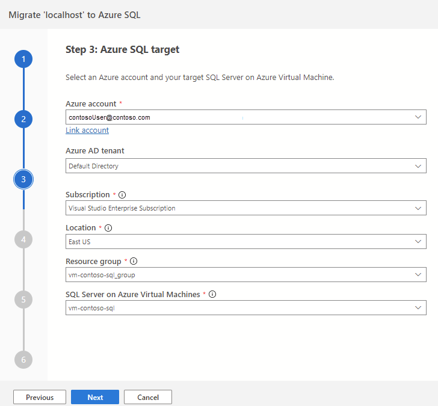

---
lab:
  title: Migración de bases de datos de SQL Server a SQL Server en una máquina virtual de Azure
---

# Migración de bases de datos de SQL Server a SQL Server en una máquina virtual de Azure

En este ejercicio, aprenderá a migrar una base de datos de SQL Server a una instancia de SQL Server que se ejecuta en una máquina virtual de Azure mediante la extensión de migración de Azure para Azure Data Studio. Empezará instalando e iniciando la extensión de migración de Azure para Azure Data Studio. Después, realizará una migración en línea de una base de datos de SQL Server a una instancia de SQL Server que se ejecuta en una máquina virtual de Azure. También aprenderá a supervisar el proceso de migración en Azure Portal y a completar el proceso de transición para finalizar la migración.

Este ejercicio dura aproximadamente **45** minutos.

> **Nota**: Para realizar este ejercicio, necesita acceso a una suscripción de Azure a fin de crear recursos de Azure. Si no tiene una suscripción a Azure, cree una [cuenta gratuita](https://azure.microsoft.com/free/?azure-portal=true) antes de empezar.

## Antes de comenzar

Para ejecutar este ejercicio, necesitará lo siguiente:

| Elemento | Descripción |
| --- | --- |
| **Servidor de destino** | Un SQL Server en una máquina virtual de Azure. Para obtener más información, visite [Aprovisionamiento de un servidor SQL Server en una máquina virtual de Azure](https://microsoftlearning.github.io/dp-300-database-administrator/Instructions/Labs/01-provision-sql-vm.html). **Nota:** La versión de SQL Server entre el destino y el servidor debe ser la misma. |
| **Servidor de origen** | La versión más reciente [de SQL Server](https://www.microsoft.com/en-us/sql-server/sql-server-downloads) instalada en un servidor de su elección. |
| **Base de datos de origen** | La base de datos ligera [AdventureWorks](https://learn.microsoft.com/sql/samples/adventureworks-install-configure) que se va a restaurar en la instancia de SQL Server 2022. |

## Aprovisionar una cuenta de Azure Storage con un contenedor de blobs

El propósito de crear una cuenta de Azure Storage es almacenar las copias de seguridad completas y del registro de transacciones para la migración. Usaremos esta cuenta de almacenamiento en pasos posteriores de este ejercicio.

1. Inicie sesión en [Azure Portal](https://portal.azure.com/).
1. En el menú izquierdo del portal, seleccione **Cuentas de almacenamiento** para mostrar una lista de las cuentas de almacenamiento. Si el menú del portal no está visible, seleccione el botón de menú para activarlo.
1. En la página **Cuentas de almacenamiento**, seleccione **Crear**.
1. En **Detalles del proyecto**, seleccione la misma suscripción de Azure en la que se va a crear la máquina virtual de Azure.
1. Seleccione el mismo grupo de recursos en el que creó la máquina virtual de Azure. 
1. Elija un nombre único para la cuenta de almacenamiento y seleccione la misma región que la máquina virtual de Azure.
1. Elija **Estándar** como nivel de servicio.
1. Deje los valores predeterminados para las opciones restantes.
1. Seleccione **Revisar y crear** y, luego, **Crear**.

Una vez creada la cuenta de almacenamiento, puede crear un contenedor siguiendo estos pasos:

1. Vaya a la nueva cuenta de almacenamiento en Azure Portal.
1. En el menú izquierdo de la cuenta de almacenamiento, vaya a **Blob service** y seleccione **Contenedores**.
1. Seleccione **+ Contenedor** para crear un nuevo contenedor.
1. En la página lateral Nuevo contenedor, proporcione la siguiente información:
    - **Nombre:** *nombre de su preferencia*
    - **Nivel de acceso público:** Privado
1. Seleccione **Crear**.

## Instale e inicie la extensión de migración de Azure para Azure Data Studio

Para instalar la extensión de migración de Azure, debe instalar [Azure Data Studio](https://learn.microsoft.com/sql/azure-data-studio/download-azure-data-studio). En este escenario, instale Azure Data Studio en el mismo servidor donde se encuentra la base de datos de origen. La extensión está disponible en el marketplace de Azure Data Studio.

Para instalar la extensión de migración, siga estos pasos:

1. Abra el administrador de extensiones en Azure Data Studio.
1. Busque ***Migración de Azure SQL*** y seleccione la extensión.
1. Instale la extensión. Una vez que la instale, encontrará la extensión de migración de Azure SQL en la lista de extensiones instaladas.
1. Conéctese a una instancia de SQL Server en Azure Data Studio.
1. Para iniciar la extensión de migración de Azure, haga clic con el botón derecho en el nombre de la instancia de origen y seleccione **Administrar** para acceder al panel y la página de aterrizaje de la extensión de migración de Azure SQL.

## Realizar una migración en línea de una base de datos de SQL Server a una instancia de SQL Server que se ejecuta en una máquina virtual de Azure

Para realizar una migración con un tiempo de inactividad mínimo con Azure Data Studio, siga estos pasos:

1. Inicie el asistente para migrar a Azure SQL desde la extensión Azure Data Studio.

1. En **Paso 1: Bases de datos para valoración**, seleccione la base de datos que quiera migrar y seleccione **Siguiente**.
    
    > **Nota**: Se recomienda recopilar datos de rendimiento y obtener recomendaciones de Azure de tamaño correcto.

1. En **Paso 2: Resultados y recomendaciones de la evaluación**, espere a que se complete la evaluación y, a continuación, seleccione **SQL Server en máquina virtual de Azure** como destino de **Azure SQL**.

1. En la parte inferior de la página **Paso 2: Resultados y recomendaciones de la evaluación**, seleccione **Ver/Seleccionar** para ver los resultados de la evaluación. Seleccione la base de datos que se va a migrar. 

    > **Nota**: Dedique un momento a revisar los resultados de la evaluación que aparecen en el lado derecho.

1. En **Paso 3: Destino de Azure SQL**, seleccione una cuenta de Azure y su instancia de SQL Server de destino en la máquina virtual de Azure.

    

1. En **Paso 4: Azure Database Migration Service**, cree un nuevo Azure Database Migration Service con el asistente de Azure Data Studio. Si ha creado anteriormente uno, puede reutilizarlo. Como alternativa, puede crear un recurso de Azure Database Migration Service a través de Azure Portal.

    > **Nota**: Asegúrese de que la suscripción esté registrada para usar el espacio de nombres **Microsoft.DataMigration**. Para saber cómo realizar un registro de proveedor de recursos, consulte [Registrar el proveedor de recursos](https://learn.microsoft.com/azure/dms/quickstart-create-data-migration-service-portal#register-the-resource-provider).

1. Copia de seguridad de la base de datos de origen. Puede [realizar una copia de seguridad en Microsoft Azure Blob Storage mediante SSMS o T-SQL](https://learn.microsoft.com/en-us/sql/relational-databases/backup-restore/sql-server-backup-to-url). Como alternativa, también tiene la opción de copiar manualmente la copia de seguridad de la base de datos en una carpeta de contenedor mediante Azure Portal.

    > **Nota**: Asegúrese de que se crea una carpeta en el contenedor antes de continuar con la copia del archivo de copia de seguridad.

1. En **Paso 5: Configuración del origen de datos**, seleccione la ubicación de las copias de seguridad de la base de datos, ya sea en un recurso compartido de red local o en un contenedor de Azure Blob Storage.

1. Inicie la migración de la base de datos y supervise el progreso en Azure Data Studio. También puede realizar un seguimiento del progreso en Azure Portal en el recurso de Azure Database Migration Service.

    > **Nota**: Azure Data Migration Services orquestará y restaurará los archivos de copia de seguridad automáticamente en el servidor de destino.

1. Seleccione **Migraciones de base de datos en curso** en el panel de migración para ver las migraciones en curso. 

    

1. Seleccione el nombre de la base de datos para obtener más detalles.

    

## Supervisión de migraciones en Azure Portal

Como alternativa, también puede supervisar la actividad de migración mediante Azure Database Migration Service. 

1. 
    
    
## Completar el proceso de transición

1. Realice una [copia de seguridad del final del registro](https://learn.microsoft.com/sql/relational-databases/backup-restore/tail-log-backups-sql-server) para la base de datos de origen.

1. En Azure Portal, cargue la copia de seguridad del registro de transacciones en el contenedor y la carpeta donde se encuentra el archivo de copia de seguridad completo.

1. En la extensión de migración de Azure, seleccione **Completar transición** en la página de supervisión.

    

1. Compruebe que todas las copias de seguridad de registros se han restaurado en la base de datos de destino. El valor **Restauración pendiente de las copias de seguridad del registro** debe ser cero. Este paso completa la migración.

    

1. El Estado de la migración cambiará a **Completando** y, luego, a **Correcto** después de que se haya completado la migración.

    > **Nota**: Puede completar la transición mediante pasos similares con Azure Database Migration Service a través de Azure Portal.

1. Después de que el estado sea **Correcto**, vaya al servidor de destino y valide la base de datos de destino. Compruebe el esquema y los datos de la base de datos.

Ha aprendido a migrar una base de datos de SQL Server a una instancia de SQL Server que se ejecuta en una máquina virtual de Azure mediante la extensión de migración de Azure para Azure Data Studio. También ha aprendido a completar el proceso de transición para finalizar la migración. Esto garantiza que todos los datos se hayan migrado correctamente y que la nueva base de datos esté totalmente operativa. Una vez completado el proceso de transición, puede empezar a usar la nueva base de datos de SQL Server que se ejecuta en una máquina virtual de Azure. 

## Limpieza

Cuando trabaje con su propia suscripción, es una buena idea al final de un proyecto identificar si todavía se necesitan los recursos que ha creado. 

Dejar que los recursos se ejecuten innecesariamente puede dar lugar a costes adicionales. Puede eliminar recursos de forma individual o bien eliminar el grupo de recursos completo desde [Azure Portal](https://portal.azure.com?azure-portal=true).

## Más información

Para obtener más información sobre SQL Server en Azure Virtual Machines, consulte [¿Qué es SQL Server en Azure Virtual Machines?](https://learn.microsoft.com/en-us/azure/azure-sql/virtual-machines/windows/sql-server-on-azure-vm-iaas-what-is-overview?view=azuresql-vm).
