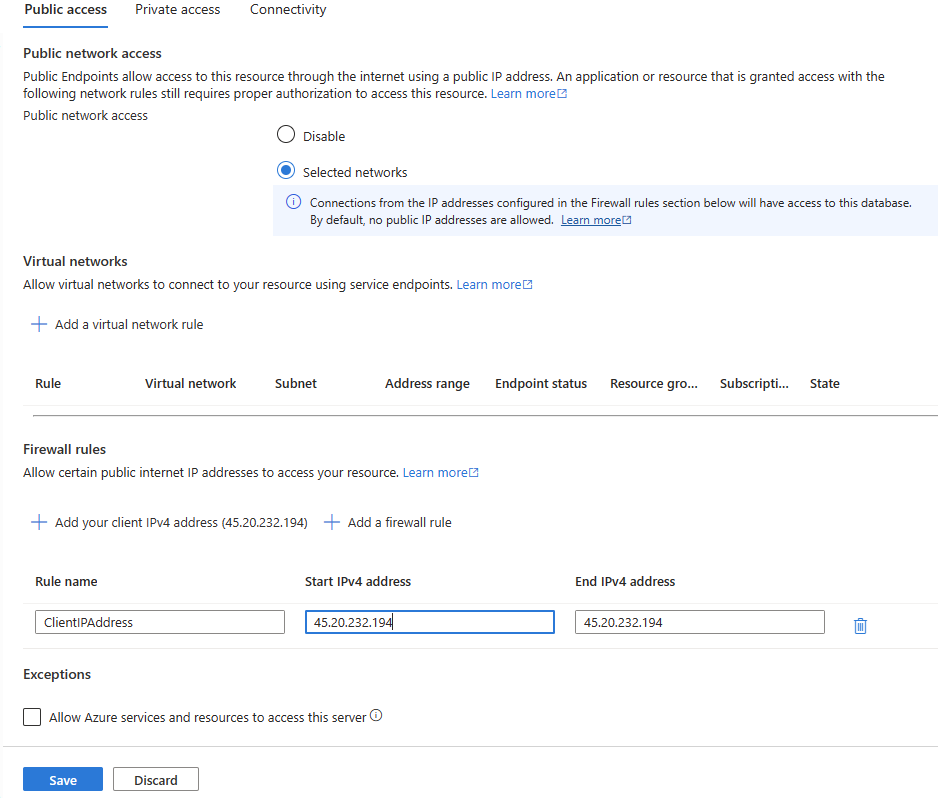

---
lab:
  title: Configuración de la replicación geográfica para Azure SQL Database
---

# Configuración de la replicación geográfica para Azure SQL Database

En este ejercicio, aprenderá a habilitar la replicación geográfica para una instancia de Azure SQL Database y a realizar una conmutación por error en una región secundaria. Esto implica crear una réplica de la base de datos, configurar un nuevo servidor para la base de datos secundaria e iniciar una conmutación por error forzada. También aprenderá a comprobar el estado de las implementaciones y a comprender el rol de las réplicas geográficas o secundarias geográficas en la administración de Azure SQL Database. Por último, conmutará por error manualmente la base de datos a otra región mediante Azure Portal. Este ejercicio proporciona experiencia práctica con aspectos clave de la administración y garantía de la resistencia de las bases de datos de Azure SQL.

Este ejercicio dura aproximadamente **30** minutos.

> **Nota**: Para realizar este ejercicio, necesita acceso a una suscripción de Azure a fin de crear recursos de Azure. Si no tiene una suscripción a Azure, cree una [cuenta gratuita](https://azure.microsoft.com/free/?azure-portal=true) antes de empezar.

## Antes de comenzar

Para completar este ejercicio, usaremos muchos recursos y herramientas. Veamos cada capa con más detalle:

|  | Descripción |
| --- | --- |
| **Servidor principal** | Un servidor de Azure SQL Database que configuraremos en este laboratorio.|
| **Base de datos principal** | La base de datos de muestra **AdventureWorksLT** creada en el servidor secundario.|
| **Servidor secundario** | Un servidor de Azure SQL Database adicional que configuraremos en este laboratorio. |
| **Base de datos secundaria** | Esta es nuestra réplica de base de datos en el servidor secundario. |
| **SQL Server Management Studio** | Descargue e instale la versión más reciente de [SQL Server Management Studio](https://learn.microsoft.com/sql/ssms/download-sql-server-management-studio-ssms). |

## Aprovisionamiento de recursos de Azure SQL Database

Vamos a crear los recursos de Azure SQL Database en dos pasos. En primer lugar, estableceremos el servidor principal y la base de datos. A continuación, repetiremos el proceso para configurar el servidor secundario con un nombre diferente. Esto da como resultado dos servidores de Azure SQL Server, cada uno con sus propias reglas de firewall. Sin embargo, solo el servidor principal tiene una base de datos.

1. Vaya a [Azure Portal](https://portal.azure.com) e inicie sesión con sus credenciales.

1. Seleccione la opción **Cloud Shell** en la barra de menús de la parte superior derecha (parece un símbolo de sistema **`>_`**).

1. Un panel se desliza hacia arriba desde la parte inferior en el que se le pide que elija el tipo de shell preferido. Seleccione **Bash**.

1. Si es la primera vez que abre **Cloud Shell**, se le pedirá que cree una cuenta de almacenamiento (que se usa para conservar los datos entre sesiones). Siga las indicaciones para crear una.

1. Una vez iniciado el shell, tendrá una interfaz de línea de comandos directamente en Azure Portal, donde puede escribir los comandos de script.

1. Seleccione **{}** para abrir el editor y copie y pegue el script siguiente. 
 
    > **Nota**: Recuerde reemplazar los valores de marcador de posición en el script por los valores reales antes de ejecutarlos. Si necesita editar el script, escriba `code` **Cloud Shell** para usar el editor de texto integrado.
        
    ```powershell
    subscription="<Your subscription>"
    resourceGroup="<Your resource group>"
    location="<Your region, same as your resource group>"
    serverName="<Your SQL server name>"
    adminLogin="sqladmin"
    password="<password>"
    databaseName="AdventureWorksLT"
    
    az account set --subscription $subscription
    az sql server create --name $serverName --resource-group $resourceGroup --location $location --admin-user $adminLogin --admin-password $password
    az sql db create --resource-group $resourceGroup --server $serverName --name $databaseName --sample-name AdventureWorksLT --service-objective Basic

    ```
    Este script de la CLI de Azure establece la suscripción activa de Azure, crea un nuevo servidor de Azure SQL Server y, a continuación, crea una nueva instancia de Azure SQL Database rellenada con los datos de ejemplo AdventureWorksLT.

1. Haga clic con el botón derecho en la página Editor y seleccione **Guardar**.

1. Proporcione un nombre para el archivo. La extensión de archivo debe ser **.ps1**.

1. En el terminal de Cloud Shell, escriba y ejecute el comando.

    ```bash
    chmod +x <script_name>.ps1

    ```
    
    Reemplace *<script_name>* para reflejar el nombre que proporcionó para el script. Este comando cambia los permisos del archivo que creó para que sea ejecutable.

1. Ejecute el script. 
    
    ```powershell
    ./<script_name>.ps1

    ```

1. Una vez completado el proceso, vaya al servidor de Azure SQL Server recién creado. Para ello, vaya a Azure Portal y vaya a la página de SQL Server. 

1. En la página principal de Azure SQL Server, seleccione **Redes** a la izquierda.

1. En la pestaña **Acceso público**, seleccione **Redes seleccionadas**.

1. En la sección **Reglas de firewall**, seleccione **+ Agregar la dirección IPv4 del cliente**. Escriba la dirección IP y seleccione **Guardar**.

    

    En este momento, debería poder conectarse a la base de datos principal `AdventureWorksLT` a través de una herramienta de cliente como SQL Management Studio.

1. Ahora vamos a crear un servidor secundario de Azure SQL Server. Repita los pasos anteriores (6-14), pero asegúrese de usar otro `serverName` y `location`. Además, omita el código que crea la base de datos comentando el comando `az sql db create`. Esto da como resultado un nuevo servidor en una región diferente sin la base de datos de ejemplo.

## Habilitación de la replicación geográfica

Ahora, vamos a crear la réplica secundaria para nuestros recursos de Azure SQL.

1. En Azure Portal, navegue de nuevo a la base de datos buscando **SQL databases**.

1. Seleccione la base de datos **SQL AdventureWorksLT**.

1. En la página principal de la base de datos de Azure SQL, seleccione **Réplicas** a la izquierda, en **Administración de datos**.

1. Seleccione **+ Crear réplica**.

1. En la página **Crear base de datos SQL - Réplica geográfica** y, en **Servidor**, seleccione el servidor SQL secundario creado recientemente.

1. Seleccione **Revisar y crear** y, a continuación, seleccione **Crear**. A continuación, se creará y se inicializará el servidor secundario. Para comprobar el estado, mire debajo del icono de notificación en la parte superior de Azure Portal. 

1. Si la operación se realiza correctamente, el estado **Implementación en curso** pasará a **La implementación se realizó correctamente**.

1. Conéctese a su Azure SQL Server secundario mediante SQL Management Studio.

## Realice una conmutación por error a una base de datos SQL en una región secundaria

Imagine un escenario en el que la base de datos principal de Azure SQL Database está experimentando problemas debido a una interrupción regional. Para garantizar la continuidad de los servicios y minimizar el tiempo de inactividad, tendría que realizar una conmutación por error forzada.

Use la conmutación por error planeada para cambiar los roles de las bases de datos principal y secundaria. La base de datos secundaria toma el control como base de datos principal y la base de datos principal original se convierte en la secundaria. Esto permite que las aplicaciones sigan funcionando con la réplica secundaria mientras se resuelven los problemas con la base de datos principal original.

Vamos a aprender a iniciar una conmutación por error forzada en respuesta a una interrupción de la región.

1. Vaya a la página Servidores SQL Server y seleccione el servidor secundario.

1. En la sección **Configuración** a la izquierda, seleccione **Bases de datos SQL**.

1. En la página principal de la base de datos de Azure SQL, seleccione **Réplicas** a la izquierda, en **Administración de datos**. Ahora se ha establecido el vínculo de replicación geográfica.

1. Seleccione el menú **...** del servidor secundario , y seleccione en **Conmutación por error forzada**.

    > **Nota**: La conmutación por error forzada cambiará la base de datos secundaria al rol principal. Todas las sesiones se desconectan durante esta operación.

1. Cuando se le solicite mediante el mensaje de advertencia, seleccione **Sí**.

1. El estado de la réplica principal cambiará a **Pendiente** y la secundaria a **Conmutación por error**. 

    > **Nota**: Esta operación puede tardar unos minutos. Una vez hecho esto, los roles se revertirán: el servidor secundario se convertirá en el nuevo servidor principal y el servidor principal original se convertirá en el secundario.

Tenga en cuenta por qué es posible que quiera colocar los servidores SQL server principal y secundario en la misma región y cuándo podría resultar beneficioso elegir regiones diferentes.

Ahora ya sabe cómo habilitar la replicación geográfica para Azure SQL Database, asegurarse de que funciona y conmutarla por error manualmente a otra región mediante el portal.

## Limpieza

Cuando trabaje con su propia suscripción, es una buena idea al final de un proyecto identificar si todavía se necesitan los recursos que ha creado. 

Dejar que los recursos se ejecuten innecesariamente puede dar lugar a costes adicionales. Puede eliminar recursos de forma individual o bien eliminar el grupo de recursos completo desde [Azure Portal](https://portal.azure.com?azure-portal=true).

## Más información

Para más información sobre la replicación geográfica para bases de datos de Azure SQL Database, consulte [Activar replicación geográfica](https://review.learn.microsoft.com/azure/azure-sql/database/active-geo-replication-overview).